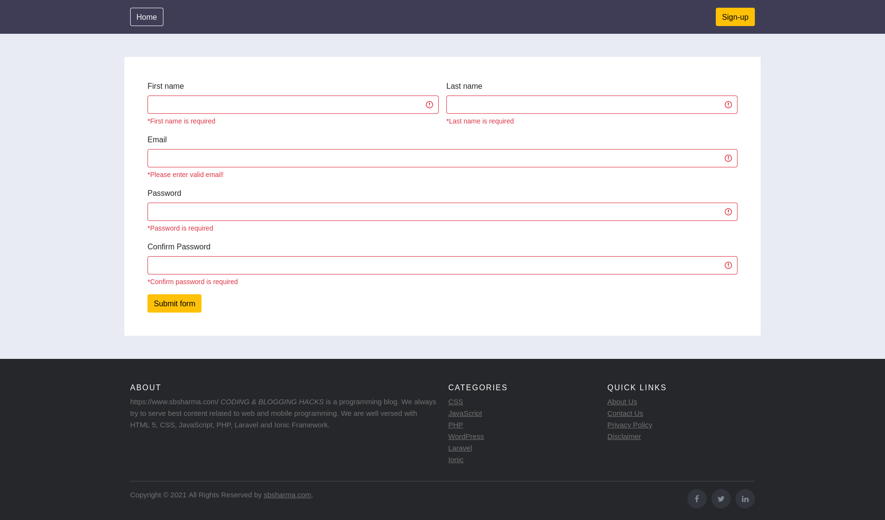

# php-form-validation
It is not a usual way to validate a form with php. It's a different way. We are using php sessions and php functions to store errors and we are showing these form errors with the help of php function to make code more cleaner and readable.

## Live Demo
[demo.sbsharma.com/php-form-validation](https://demo.sbsharma.com/php-form-validation/)

## Final output

# Read Blog
[PHP form validation](https://sbsharma.com/php-form-validations/)

# Contributor
[Satpal Bhardwaj](https://sbsharma.com/ionic/)

# Follow us

